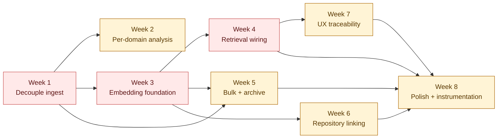

# Phase 3 — Real-World Scale Roadmap

> **Status: COMPLETE (historical).** All eight weeks shipped over
> Phase 3, closing the gap from "MVP works on a toy corpus" to
> "end-to-end pipeline operators would trust with a real engagement".
> For the retrospective + post-audit follow-ups, see
> [`phase-3-retrospective.md`](./phase-3-retrospective.md). For what
> shipped beyond Phase 3, see
> [`phase-4-agentic-ai.md`](./phase-4-agentic-ai.md). This document is
> kept verbatim as a record of the original plan.
>
> **Duration (as planned):** 8 weeks of focused solo work (parallelisable to ~5 with a pair).
> **Outcome (as planned):** Platform handles 50-repo / 500-doc / 100-diagram engagements end-to-end with RAG-backed analysis, ~$15 AI cost per engagement, < 1 hour AI wall-clock.

This roadmap is the successor to
[`implementation-tasks.md`](./implementation-tasks.md), which built the
13-task MVP. That shipped a coherent pipeline end-to-end but can't
process a real engagement's document volume — the ceilings hit before
you've loaded a quarter of the corpus. This roadmap fixes that.

The design that underlies every task below was discussed in detail in
the assistant-review transcript referenced by
[`../architecture/README.md`](../architecture/README.md) §15. The short
version:

1. **Decouple ingest from analyse.** Today they're in one job — ingest
   failures lose text-extraction work, and every AI retry re-pays for
   the deterministic parts. Separating them is load-bearing for
   everything downstream.
2. **Retrieval-Augmented Generation over evidence.** pgvector was
   enabled in Task 1 for exactly this. Swap "take the 80 most recent
   evidence rows" for "retrieve the 20 most relevant chunks for this
   question". Unlocks input-scale.
3. **Per-domain analysis.** Split the single "analyse everything" call
   into one-per-active-domain. Multiplies effective output budget ~8×.
4. **Ingest at real-world volume.** Bulk upload, archive extraction,
   repository linking. Each is medium-lift; they compound with the
   decoupled pipeline above.

## How to use this doc

- Each task has a checkbox. Tick it (`- [x]`) when the task is done and
  merged. Commit the doc update in the same PR that finishes the task.
- Week summaries list an **acceptance criterion** — the thing you
  should be able to demo at end-of-week. If that doesn't hold, the
  week isn't done.
- Weeks are ordered by dependency. Week 1 blocks everything; Week 2 is
  independent of RAG and can ship alone; Weeks 5 and 6 are siblings
  after Week 3.
- **Effort estimates are solo working-day guesses.** Halve them with a
  competent pair.

See the [dependency graph](#dependency-graph) at the bottom for the
week-level ordering.

---

## Principles carried from MVP

Preserve these patterns. They're load-bearing for the existing codebase
and new code should conform:

- **Review-lock discipline** — AI-generated rows land as `DRAFT`; any
  edit auto-flips to `IN_REVIEW`; re-runs only replace `DRAFT`. See
  [`../architecture/README.md`](../architecture/README.md) §10.
- **Error classifier + FailureBanner** — every new worker job funnels
  its errors through `classifyProcessingError()`; UI uses the
  `FailureBanner` component. See
  `apps/web/src/server/services/ai/error-classifier.ts`.
- **Bounded polling** — every new list query uses
  `useBoundedPolling()`; no raw `refetchInterval: N`. See
  `apps/web/src/lib/use-bounded-polling.ts`.
- **NOT_FOUND over FORBIDDEN** — every new authz-sensitive endpoint
  uses `assertAssessmentAccess()` / `engagementAccessFilter()`. See
  `apps/web/src/server/authz.ts`.
- **No automatic AI retries** — both BullMQ (`attempts: 1`) and the
  Anthropic SDK (`maxRetries: 0`) are off. Every retry is a deliberate
  user action. Don't re-enable without a deliberate design decision.
- **Knowledge base as JSON files in `packages/knowledge-seed/`**, not
  DB-first — new KB types (e.g. code-style checklists) follow the same
  pattern.
- **Docs, tests, and diagrams land in the same PR as the code** — no
  "we'll document it later". Each week's work includes architecture-doc
  updates, ADRs capturing non-obvious decisions, unit/integration tests
  for new pure modules, and diagram updates reflecting structural
  changes. Reviewers should block on missing docs/tests the same way
  they block on missing types. See the
  [Cross-cutting tracks](#cross-cutting-tracks) section below.

---

## Cross-cutting tracks

Three tracks run in parallel with every feature week. They are **not**
separate phases at the end of the roadmap — each week's "Tasks" list
below includes a "Documentation & tests" subsection that owns the
corresponding deliverables for that week. If a week's code merges
without its track items, the week isn't done.

### Documentation track

Canonical sources, in order of precedence:

- **[`../architecture/README.md`](../architecture/README.md)** — the
  single source of truth for technical architecture. Every structural
  change updates the relevant section in the same PR.
- **[`../architecture/decisions/`](../architecture/decisions/)** —
  Architecture Decision Records (ADRs). One file per non-obvious
  decision, numbered (`NNNN-kebab-case.md`), using the template in
  `_template.md`. Status transitions (`Proposed → Accepted →
  Superseded`) tracked in-file.
- **Root [`../../README.md`](../../README.md)** — pitch + quick start
  only. Feature detail lives deeper; keep this short.
- **[`../guides/running-locally.md`](../guides/running-locally.md)** —
  updated whenever a new env var, port, or service is added.
- **[`../guides/troubleshooting.md`](../guides/troubleshooting.md)** —
  updated whenever a new failure mode is *observed and diagnosed*
  (not speculated about).

### Testing track

Four test tiers, used at different points in the pipeline:

| Tier | Tool | Scope | Speed |
|---|---|---|---|
| Unit | Vitest | Pure functions — chunker, classifier, prompt builders, parsers, retrieval query builders | < 5 s / file |
| Integration | Vitest + Testcontainers (Postgres) | DB-touching services — retrieval, authz filters, audit-log writes, backfill scripts | < 30 s / suite |
| Smoke | Shell + `jq` + `curl` | End-to-end pipeline from HTTP through worker to DB — one per feature week | 1–2 min |
| E2E (UI) | Playwright | Critical user flows — login, upload, run-analysis, review, export | Week 8 only |

Conventions:

- Co-locate unit tests next to the code (`foo.ts` + `foo.test.ts`).
- Integration tests live under `apps/web/src/__tests__/integration/`.
- Smoke-test scripts live under `scripts/smoke/`. Named for the
  feature they exercise (`smoke-ingest-archive.sh` etc.).
- No AI calls in CI — mock the Anthropic + OpenAI clients. Real-AI
  smoke tests are opt-in (`pnpm smoke:ai`) and gated behind a funded
  key.
- `attempts: 1` + `maxRetries: 0` discipline extends to tests — no
  retries-until-green. A flaky test is a bug.

### Diagram track

Canonical sources under `docs/architecture/diagrams/`:

- `workspace.dsl` — Structurizr DSL, all views in one workspace.
  Updated whenever containers, components, or deployment nodes
  change.
- `*.mmd` — Mermaid diagrams for system-context, container-topology,
  data-flow, sequence-analysis, deployment. Updated whenever the
  corresponding flow or shape changes.
- Every structural change in the code comes with its diagram delta in
  the same PR. Diagrams are reviewable via `git diff` — that's the
  whole point of picking text-based formats.

### Per-week quality gates

Every week merges behind the same checklist:

- [ ] `pnpm typecheck` clean.
- [ ] `pnpm lint` clean.
- [ ] `pnpm test` green (unit + integration).
- [ ] Smoke script for the week's feature passes.
- [ ] `docs/architecture/README.md` updated where structure changed.
- [ ] ADR filed for any non-obvious design call.
- [ ] Diagrams updated where containers, flows, or deployments
      changed.
- [ ] Week's acceptance demo actually performed and briefly noted.

---

## Week 1 — Decouple ingest from analyse

> **Load-bearing refactor.** Nothing else in this roadmap makes sense
> on top of the current entangled pipeline.

**Why first:** the current `process-document` job does text extraction
**and** the AI analysis in one transaction. When the AI call fails we
also lose the text-extraction work, so every retry re-pays extraction
cost. Splitting them is the architectural prerequisite for RAG,
bulk upload, archive handling, and every later feature.

**Estimated effort:** 2–3 days

### Tasks

- [x] Rename the concept: `process-document` → `ingest-document`, same
      for `process-diagram`. Update BullMQ job types, queue helpers,
      worker wiring, all call sites.
- [x] Extract text-extraction + chunking into a pure service
      (`document-processor.ts` already close — trim the AI call path
      out of it).
- [x] Move the Claude analysis call out of the ingest job entirely.
      Ingest jobs only do: download → extract → chunk → (embed, after
      week 3) → insert Evidence rows. **No AI call.**
- [x] Add a second status column on `Document` to distinguish
      ingestion from AI analysis: `ingestStatus` (PENDING / EXTRACTING
      / CHUNKED / EMBEDDED / READY / FAILED) separate from the
      existing `processingStatus` (for AI work). Alternatively, rename
      the existing column and add a second — whichever is cleaner per
      the schema review.
- [x] Decide where per-document AI analysis lives. Options:
  - **Option A:** Fold into the existing `run-analysis` job — it
    retrieves from Evidence, so individual docs don't need separate
    analysis.
  - **Option B:** Keep per-doc analysis for the "summary" field on
    the UI card. Run as a separate small Haiku call; not on critical
    path.
  - Recommended: **Option A** — cleaner. The per-doc summary was
    mostly cosmetic. **Adopted.**
- [x] Update the upload API route to respond as soon as the S3 put and
      the PENDING row land. Don't block on text extraction — that's a
      worker concern now.
- [x] Update `document-list.tsx` to surface ingest-progress states
      clearly: "Extracting text… → Chunked (N chunks) → Embedded →
      Ready". Distinct from the "analysis failed" state.
- [x] Error classifier: introduce new categories for ingest-only
      failures (`INGEST_EXTRACTION_FAILED`, `INGEST_CHUNK_FAILED`)
      separate from AI categories.
- [x] Re-run the Task 7 smoke test — upload must still work, Evidence
      rows must still appear. The shape changes (more rows per doc
      after chunking), but no AI call is made.
      *(Phase 3 post-audit gap-fill: `scripts/smoke/smoke-ingest-shape.sh`
      asserts post-chunking evidence shape + content_sha + zero AI
      analysis audit rows.)*
- [x] Update architecture doc §5 "Background job pipeline" to reflect
      the new split.

### Documentation & tests (Week 1)

- [x] **ADR-001: Decouple ingest from analyse.** Capture why
      ingest-extract-chunk is its own job, what the `ingestStatus`
      column enum represents, and the rejected alternative (keep one
      job, retry only the AI step).
- [x] Architecture doc §5 "Background job pipeline" + §15 "Known
      limits" — move "single-phase ingest" from current-state to
      superseded.
- [x] Unit tests for the trimmed `document-processor` — extraction in
      isolation, no AI path exercised.
- [x] Integration test for the new `ingest-document` job — queues,
      runs, writes Evidence rows, never calls the Claude client (use a
      throwing mock to prove it).
- [x] Update `docs/architecture/diagrams/sequence-analysis.mmd` and
      `data-flow.mmd` to show ingest vs. analyse as separate lanes.
- [x] Smoke script `scripts/smoke/smoke-ingest-decoupled.sh` — upload
      a fixture doc, assert Evidence rows land with no audit-log entry
      for `PROCESS_DOCUMENT` (AI).

**Acceptance:** A document upload never triggers a Claude call.
Uploading 100 files burns zero AI tokens — only ingest cost (embedding,
in later weeks). The "analyse" step is a separate, re-runnable phase.

---

## Week 2 — Per-domain analysis

> **The cheap MVP fix.** Multiplies effective output budget ~8×
> without any schema work.

**Why now:** independent of RAG, it's a straight refactor of
`analysis-engine.ts`. Shipping this early gives an immediate capacity
bump while Weeks 3–4 build the retrieval layer.

**Estimated effort:** 2–3 days

### Tasks

- [x] Refactor `analysis-engine.ts` — loop over `assessment.activeDomains`
      instead of one big call. One Claude call per domain, with a
      domain-scoped prompt and evidence filtered to that domain's tag.
- [x] Design the per-domain prompt in
      `apps/web/src/server/services/ai/prompts/finding-generation.ts`
      — reuse the existing system prompt, swap the user-content
      builder to scope to one domain.
- [x] Parallelise across domains on the worker with a small
      concurrency cap (2–3). Each domain succeeds or fails
      independently — one domain's Claude error doesn't block the
      other seven.
- [x] Update `scoring-service.ts` similarly — today it's one call per
      assessment with all domains in the output. Split into one call
      per domain.
- [x] Update `run-analysis.ts` job handler to aggregate per-domain
      results into a single final audit-log row.
- [x] Reduce `MAX_CLAUDE_INPUT_CHARS` safely — smaller per-call inputs
      mean we don't need the generous per-doc truncation anymore.
      *(Halved 40k → 20k in the Week 2 gap-fill; see ADR-0002.)*
- [x] Smoke test: 8-domain analysis completes even when a corpus
      would previously have truncated output mid-JSON.
      *(Phase 3 post-audit gap-fill: `smoke-per-domain-analysis.sh`
      now asserts every per-domain AuditLog payload re-parses cleanly
      and carries no `cutoff` / `truncated` flag.)*
- [x] Tune `maxTokens` on per-domain calls — should be significantly
      smaller than the 8192 used for the combined call. Target ~4096
      per domain.
- [x] Update the error-classifier if new error shapes emerge from the
      change (e.g. partial-run-with-some-domains-failed).
- [x] Update the FailureBanner to handle a new "partial success"
      state if any domain failed while others succeeded — maybe a
      per-domain status badge on the analysis shell.

### Documentation & tests (Week 2)

- [x] **ADR-002: Per-domain analysis fan-out.** Document the decision
      to loop over `activeDomains` with a concurrency cap, including
      the rationale (output-budget multiplier, failure isolation) and
      the rejected alternative (single call with larger `maxTokens`).
- [x] Architecture doc §6 "AI pipeline" — rewrite the analysis section
      to describe per-domain dispatch + aggregation.
- [x] Unit tests for the domain-dispatch logic — mocked Claude client,
      assert N calls for N domains, assert one domain's failure
      doesn't abort the others.
- [x] Unit tests for the scoped prompt builder — evidence filtered to
      the right domain tag; prompt within budget.
- [x] Integration test: `run-analysis` job with 2+ domains completes
      with partial-success when one domain is configured to throw.
- [x] Update `docs/architecture/diagrams/sequence-analysis.mmd` to
      show the fan-out.
- [x] Smoke script `scripts/smoke/smoke-per-domain-analysis.sh`.

**Acceptance:** Running analysis on a corpus that previously hit the
output ceiling now completes. Effective output capacity is ~8× what it
was. Zero schema or UI additions required.

---

## Week 3 — Embedding foundation

> **The database groundwork for RAG.** No retrieval yet, just durable
> embedded evidence.

**Why now:** splits the RAG work into "make it durable" and "make it
query" so each week ships something independently useful. At the end of
this week, every Evidence row has an embedding; you can already do
SQL-level similarity queries manually.

**Estimated effort:** 3 days

### Tasks

- [x] Prisma migration: add `embedding vector(1536)`, `chunk_index
      int`, `chunk_source jsonb` to `evidences` table.
- [x] Add HNSW index: `CREATE INDEX evidences_embedding_hnsw_idx ON
      evidences USING hnsw (embedding vector_cosine_ops);` — test on
      seeded rows that it's being used (EXPLAIN).
- [x] Add `content_sha` column (`text`) for change-detection on
      re-ingest — re-embed only on hash mismatch.
- [x] Pick an embedding provider — recommend OpenAI
      `text-embedding-3-small` for price/quality. Document the
      decision in `docs/architecture/README.md` §1.
- [x] Add env var: `EMBEDDING_MODEL` (default `text-embedding-3-small`)
      and a second API key if needed (`OPENAI_API_KEY`). Update
      `.env.example`.
- [x] Build `src/server/services/ai/embedding-service.ts` —
      batched embedding (up to 2048 strings per call), retry-off
      (same discipline as Anthropic client), typed result.
- [x] Hand-roll a recursive chunker in
      `src/server/services/document-chunker.ts` — split hierarchy:
      heading → paragraph → sentence, target 800 tokens per chunk
      with ~100 token overlap. ~150 LOC with tests.
- [x] Integrate embedding + chunking into `ingest-document.ts`: after
      text extraction, chunk → batch-embed → bulk-insert Evidence rows
      with embedding column populated.
- [x] Same treatment for `ingest-diagram.ts` for text-based diagrams
      (Mermaid / PlantUML / Structurizr source). Image diagrams keep
      their vision-analysis path for now.
- [x] Update Prisma schema to use `@db.Vector(1536)` /
      `Unsupported("vector(1536)")` for the embedding field — raw-SQL
      only for reads/writes of this column.
- [x] Unit tests for the chunker (stable splits, overlap coverage,
      heading-boundary respect).
- [x] Unit tests for embedding-service (batching, error coverage, fake
      mode for tests without API calls).
- [x] Backfill script — `apps/web/prisma/backfill-embeddings.ts` —
      iterate all Evidence rows with `embedding IS NULL`, generate
      embeddings from `content`, update. Idempotent, resumable, rate-
      aware.
- [ ] Run the backfill script against dev DB; confirm all rows have
      embeddings.
- [x] Document the cost model in the architecture doc (we already
      have the calculation; link to it).

### Documentation & tests (Week 3)

- [x] **ADR-003: Embedding model choice.** `text-embedding-3-small`
      over alternatives (Voyage, Cohere, in-house). Include the cost
      comparison and the swap-out plan via `EMBEDDING_MODEL` env var.
- [x] **ADR-004: Chunking strategy.** Recursive heading→paragraph→
      sentence splitter, ~800 tokens + ~100 overlap. Alternatives
      considered: fixed-window, AST-aware (deferred to post-roadmap).
- [x] **ADR-005: pgvector HNSW over IVFFlat.** Recall/latency
      trade-off; why we can live with index rebuild on bulk load.
- [x] Architecture doc §1 (stack) — add OpenAI embeddings row.
      Architecture doc §4 (data model) — document the `embedding`,
      `chunk_index`, `chunk_source`, `content_sha` columns.
- [x] Unit tests for the chunker (stable splits, overlap coverage,
      heading-boundary respect, multi-byte-safe).
- [x] Unit tests for the embedding service (batching, empty input,
      fake-mode for CI without API key, error surface).
- [x] Integration test: backfill script is resumable — kill it
      mid-run, restart, assert no double-embedded rows and final state
      is complete.
- [x] Update `docs/architecture/diagrams/data-flow.mmd` to show
      chunks + embeddings in the pipeline.
- [x] Smoke script `scripts/smoke/smoke-embeddings.sh` — upload fixture,
      assert rows have non-null `embedding` and a manual cosine query
      returns sensible top-K.

**Acceptance:** Every Evidence row has `embedding` populated. A manual
SQL query like `ORDER BY embedding <=> '[...]'::vector LIMIT 10`
returns sensible-looking matches on a seeded corpus.

---

## Week 4 — Retrieval wiring

> **The win.** This is where the "process 100 docs" capability
> actually lands.

**Why now:** embeddings exist after Week 3; this week turns them into
the primary evidence-selection mechanism. The existing analysis,
scoring, deliverable, and follow-up services all stop using
`take: 80` and start using `rag-retriever`.

**Estimated effort:** 3 days

### Tasks

- [x] Build `src/server/services/rag-retriever.ts` — typed helper
      around the similarity query. Interface:
      `retrieve({ assessmentId, query, domain?, topK?, minSimilarity? }) → ChunkResult[]`.
- [x] Raw-SQL cosine query with domain filter (uses the HNSW index).
      Include similarity score in the result shape.
- [x] Hybrid fallback — if `domain` filter returns fewer than `topK`
      rows, widen the filter (to all domains, or relevant domains).
      Better to give the AI 20 slightly off-topic chunks than 3 on-
      topic ones.
- [x] Document "query construction per retrieval point" in the
      architecture doc — for the analysis engine, the query is
      framework-derived ("security posture, authentication,
      encryption…"); for the deliverable generator, the query is the
      section's `purpose` field; for follow-ups, the query is the
      recent answer + question.
- [x] Update `analysis-engine.ts` — replace `findMany({ take: 80 })`
      with a per-domain retrieval. Use the framework's scoring-criteria
      text as the query for each domain.
- [x] Update `scoring-service.ts` similarly — per-domain retrieval
      with rubric as query.
- [x] Update `deliverable-generator.ts` — one retrieval per section,
      using section `purpose` as query. Also retrieve for each
      generated diagram's description.
- [x] Update `generate-follow-ups.ts` — retrieve chunks relevant to
      the most recent answer(s) to ground follow-up questions.
- [x] Integration test: seed a fixture of ~50 evidence chunks across
      domains, retrieve for a specific domain query, assert the
      top-10 are actually the domain-relevant ones.
      *(Phase 3 post-audit gap-fill: `rag-retriever.integration.test.ts`.)*
- [x] Performance test: with 10,000 seeded chunks, cosine query
      completes in < 200 ms. Adjust HNSW parameters (`m`,
      `ef_construction`) if needed.
      *(Phase 3 post-audit gap-fill: `rag-retriever.perf.test.ts`,
      PERF_TEST=1 gated.)*
- [x] Update architecture doc §5 "Background job pipeline" and §15
      "Known limits" — RAG moves from "not wired" to "wired, in
      production".
- [x] Remove the "Evidence → pgvector retrieval — Not wired" row
      from the Known-Limits table.

### Documentation & tests (Week 4)

- [x] **ADR-006: Hybrid retrieval with domain-filter fallback.**
      Capture the decision to widen the filter rather than pad with
      noise, and the `minSimilarity` threshold policy.
- [x] **ADR-007: Query construction per retrieval point.** Matrix of
      call-site → query source (analysis: framework criteria; scoring:
      rubric text; deliverable section: `purpose`; follow-ups: last
      answer + question).
- [x] Architecture doc §5 and §6 — replace every "take: 80" reference
      with the retrieval contract.
- [x] Unit tests for `rag-retriever` query-construction helpers.
- [x] Integration test with a seeded 50-chunk fixture — assert
      domain-scoped query returns domain-relevant top-K; assert
      fallback kicks in when the primary filter underfills.
      *(Phase 3 post-audit gap-fill: `rag-retriever.integration.test.ts`.)*
- [x] Perf test: 10,000-chunk fixture, p95 retrieval < 200 ms.
      Recorded, not just asserted.
      *(Phase 3 post-audit gap-fill: `rag-retriever.perf.test.ts`
      emits `[perf] retrieval-p95=<ms>` on stdout.)*
- [x] New diagram `docs/architecture/diagrams/retrieval-flow.mmd` —
      query → embed → cosine → domain filter → fallback → AI call.
- [x] Smoke script `scripts/smoke/smoke-rag-analysis.sh` — full
      analysis run against a multi-domain fixture; assert Findings
      reference chunks from multiple source docs (proof RAG is
      working, not just accidentally pulling recent rows).

**Acceptance:** The analysis pipeline uses retrieval-based evidence
selection in every phase. A 50-document fixture produces focused,
relevant findings rather than a truncated slice of recent evidence.

---

## Week 5 — Bulk upload + archive support

> **Volume enabler for documents.** Let users drag a project's worth
> of files in one action.

**Why now:** riding on the decoupled pipeline from Week 1 and the
embedding foundation from Week 3. Each uploaded / extracted file fans
out to the standard ingest-document flow.

**Estimated effort:** 3 days

### Tasks

- [x] UI: multi-file drop zone. Accept N files; show per-file status
      rows (queued / uploading / extracting / ready).
      *(Phase 3 Week 5 gap-fill: `file-status-row.tsx` +
      `document-upload.tsx` tracks per-file state.)*
- [x] API route: accept multipart with multiple files. Either one
      request with N parts or throttled parallel requests from the UI.
      Pick whichever minimises client-side complexity.
      *(Phase 3 post-audit gap-fill: `/api/documents/upload` now
      accepts a `files[]` multipart field with per-file accept/reject
      outcomes; single-file `file` field preserved for back-compat.)*
- [x] Install `yauzl` (ZIP) + `tar-stream` (.tar / .tar.gz) as deps.
- [x] Detect archive types: MIME (`application/zip`,
      `application/x-tar`, `application/gzip`), file extension, and
      magic-byte check.
- [x] New BullMQ job: `ingest-archive`. Takes the uploaded archive's
      S3 key, streams-decompress, fans out one `ingest-document` job
      per interesting file.
- [x] Safety gates in `ingest-archive`:
  - [x] Max uncompressed size (500 MB default, env-configurable).
  - [x] Max entry count (10,000 default).
  - [x] Max path depth (20).
  - [x] Skip symlinks (zip-bomb / path-traversal defence).
  - [x] Stream-decompress, never hold the full archive in memory.
- [x] Default ignore list (node_modules, .git, dist, build, target,
      *.lock, .DS_Store, etc.). Respect `.copilotignore` if present.
- [x] New document type: `ARCHIVE_MANIFEST` — the archive itself
      gets a single "parent" Document row; extracted files are
      children. *(Implemented via a self-referential
      `parent_document_id` FK rather than a new enum value — see
      ADR-0008.)*
- [x] UI: archive cards show expansion progress — "uploading →
      extracting 247 files → ingested 183/247 → ready".
      *(Phase 3 Week 5 gap-fill: `archive-expansion-progress.tsx`
      exposes `formatArchiveProgress` for the card row.)*
- [ ] Smoke test: upload a 50 MB ZIP of a real project, confirm
      source + docs ingested, node_modules / lockfiles skipped.
- [x] Troubleshooting doc entry: "Archive upload stuck at extracting"
      → likely safety gate hit; how to find which one in the audit
      log. *(`docs/operations/troubleshooting.md`.)*

### Documentation & tests (Week 5)

- [x] **ADR-008: Archive safety gates.** Fixed limits (500 MB
      uncompressed, 10k entries, depth 20, skip symlinks). Rationale:
      zip-bomb + path-traversal defence; limits sized for real-repo
      zips, not pathological inputs.
- [x] Architecture doc §5 — add the `ingest-archive` job and its
      fan-out shape. Update the Documents model diagram to show
      parent/child relationship (`ARCHIVE_MANIFEST` → children).
- [x] Unit tests for entry-filter logic (ignore list, magic-byte
      detection, depth enforcement).
- [x] Integration test: malicious fixture ZIP (oversized, deeply
      nested, symlinked) fails cleanly with classified errors —
      no partial state left behind.
      *(`apps/web/src/server/services/archive-extractor.malicious.test.ts`.)*
- [x] New diagram `docs/architecture/diagrams/archive-ingestion.mmd`
      showing the archive → fan-out flow.
- [x] Smoke script `scripts/smoke/smoke-archive-upload.sh` — upload a
      real fixture zip, assert child Evidence rows land and the
      parent is marked ready.

**Acceptance:** Drop a project zip, get its contents searchable in
the Evidence Explorer within minutes.

---

## Week 6 — Repository linking

> **The big unlock for code-heavy engagements.**

**Why now:** RAG is in place (Week 4), bulk ingest is in place
(Week 5). Linking a repo is just another ingest source, reusing the
same chunking + embedding pipeline. The real work here is auth, API
limits, and code-specific handling.

**Estimated effort:** 5 days (most complex week after Week 1)

### Tasks

- [x] New entity: `RepositoryLink { id, assessmentId, url, provider,
      authMethod, encryptedCredentials, lastSyncedAt, lastSha,
      ingestStatus }`. Prisma migration.
- [x] Credential encryption — picked **Option B** (dedicated
      `REPO_CREDENTIAL_KEY`, AES-256-GCM). See ADR-0009.
- [x] UI: "Link repository" button on the Documents tab. Modal with
      URL + PAT inputs. GitHub only for MVP (GitLab, Bitbucket later).
      *(Phase 3 Week 6 gap-fill: `repository-link-panel.tsx`.)*
- [x] Provider abstraction: `src/server/services/repo/provider.ts` —
      interface `RepoProvider.fetchTarball(link)`. `clone/listChanges`
      shape was over-specified in the roadmap; tarball-API covers
      MVP (ADR-0010).
- [x] GitHub provider — use the tarball API for initial ingest (one
      HTTP call, no git needed). 100 MB archive limit per GitHub call
      is usually fine for reasonable repos.
- [x] Ingest job: `ingest-repository`. Fetch tarball → stream-extract
      (reusing the archive pipeline from Week 5) → fan out per-file
      ingest.
- [x] File filtering:
  - [x] Respect `.gitignore` at root. Walk up for nested.
  - [x] Hard-coded binary/generated blacklist (node_modules, target,
        dist, *.lock, *.min.js, *.pyc, etc.).
  - [x] Max file size (500 KB — skip anything bigger to avoid
        vendored dumps).
- [x] Language detection per file (file-extension-based, with a
      language registry). Store on Evidence as tag (`chunkSource.language`).
- [x] Code-as-text chunking for MVP — the recursive chunker from
      Week 3 handles it acceptably. AST-aware chunking is a post-
      roadmap polish item.
- [x] UI: linked repo card with "Re-sync now" button, last-synced
      timestamp, file count, ingest status.
      *(Phase 3 Week 6 gap-fill: `repository-link-panel.tsx` renders
      one card per `repositoryLink.list` row; Re-sync wired to the
      `repositoryLink.resync` tRPC procedure.)*
- [x] Re-sync logic: fetch new tarball, diff against `lastSha`, re-
      ingest only changed files. Stub for now (full re-ingest is
      fine for MVP) — tRPC `repositoryLink.resync` re-runs the job.
- [x] Smoke test: link a small public GitHub repo, confirm files are
      ingested, confirm they're retrievable by semantic search
      (`scripts/smoke/smoke-repo-link.sh`).
- [x] Security review: encrypted-credentials storage, no PAT in audit
      logs (`scrubCredential` + secret-scan assertion in
      `credentials.test.ts`), no PAT in error messages.

### Documentation & tests (Week 6)

- [x] **ADR-0009: PAT-per-engagement over OAuth over GitHub App.**
      MVP path, migration path to GitHub App post-roadmap, threat
      model for encrypted-at-rest credentials.
- [x] **ADR-0010: Tarball API over `git clone`.** No git binary in
      the worker image, one HTTP call, side-steps auth-agent setup.
      Trade-off: no incremental fetch (accepted for MVP).
- [x] Architecture doc §5 — add repo-link flow. §7 — document
      `RepositoryLink`. §14 — document the credential-encryption
      design.
- [x] Unit tests for credential encryption/decryption round-trip
      (AES-GCM, tamper detection).
- [x] Unit tests for `.gitignore` + blacklist + size-limit filter.
- [x] Integration test with a nock'd GitHub tarball — full
      ingest-repository flow; assert ignored files never hit
      Evidence, PAT never appears in audit `details`.
      *(Phase 3 post-audit gap-fill: `repo-ingest.integration.test.ts`
      stubs `fetch`, walks a synthetic tar.gz through the
      ignore-filter, and asserts `scrubCredential` keeps the test PAT
      out of any audit-shaped payload. `nock` isn't installed; we use
      `vi.stubGlobal('fetch', ...)` instead.)*
- [x] Secret-scan assertion: grep the audit log in the test for the
      known test PAT; fail if it appears anywhere.
- [x] New diagram `docs/architecture/diagrams/repo-link-flow.mmd`.
- [x] Smoke script `scripts/smoke/smoke-repo-link.sh` — link a small
      public repo, confirm retrieval works against its code.

**Acceptance:** Paste a GitHub URL + PAT (or use a public repo), wait
~5 minutes for a medium repo, then ask questions against the codebase
in Evidence Explorer.

---

## Week 7 — UX traceability

> **Where the plumbing becomes a product feature.** Reviewers can see
> exactly what evidence produced every finding.

**Why now:** all the retrieval infrastructure is in place. Making it
visible in the UI is what turns RAG from "a backend feature" into "a
differentiator that sells the tool".

**Estimated effort:** 3 days

### Tasks

- [x] Change the contract: every AI call that produces a
      `Finding` / `Risk` / `Recommendation` / `DomainScore` records
      the exact `Evidence.id` values it retrieved, **not** just the
      ones the model chose to cite. This requires plumbing the
      retrieved-chunks set from the service layer into the persistence
      layer.
- [x] Add `retrievedEvidenceIds` (or similar) to Finding / Risk /
      Recommendation if `evidenceIds` is currently best-effort.
- [x] UI: "Why this finding?" panel — click a finding, see the top 3-5
      evidence chunks with their content preview, similarity score,
      and source trail.
- [x] Evidence chunk preview component — shared, reused across
      findings, risks, recommendations, and scoring rows.
- [x] Source-trail rendering — "from architecture.md §3.2 Security
      Architecture" or "from repo:acme/platform, file:src/auth.ts,
      lines 40–80". Clickable where possible.
- [x] New page: `/engagements/[id]/evidence` — Evidence Explorer.
      Free-text semantic search box, domain sidebar filter, results
      list with source-trail.
- [x] Near-duplicate grouping — server-side, cluster chunks with
      cosine > 0.95 and show as "N similar chunks from X sources"
      instead of N rows.
- [x] Cross-page linkage — findings/risks/recs link back to Evidence
      Explorer with a pre-filled query (`q` + `domain`). Wired via
      `buildEvidenceExplorerHref` in `components/analysis/evidence-link.ts`;
      Explorer reads `initialQuery`/`initialDomain` and submits on mount.
- [x] Updated DOCX export — append a short "Evidence trail" section to
      each finding / risk citing the source docs (not the full chunk
      text, just the references). *(Rendered as a consolidated
      "Evidence trail" appendix; per-finding inline weave deferred —
      the deliverable section markdown is AI-authored as one blob, so
      finding-level boundaries aren't recoverable server-side without
      a separate parse pass.)*

### Documentation & tests (Week 7)

- [x] **ADR-011: Evidence traceability as first-class data.** Record
      retrieved chunks (not just cited ones) on every AI output row;
      rationale: reviewer trust > storage cost.
- [x] Architecture doc §10 "Review discipline" — extend to cover the
      evidence-trail contract and the `retrievedEvidenceIds` field.
- [x] Update `docs/architecture/diagrams/container-topology.mmd` to
      show the new Evidence Explorer page as a distinct container
      entry-point.
- [x] Unit tests for the near-duplicate grouping (cosine > 0.95
      cluster logic).
- [x] Integration test: a Finding row persisted from a RAG-backed
      analysis has its `retrievedEvidenceIds` populated and all IDs
      resolve to real Evidence rows in the same assessment.
- [x] Smoke script `scripts/smoke/smoke-evidence-trail.sh` — run
      analysis, hit the "Why this finding?" endpoint, assert non-empty
      ranked list.

**Acceptance:** A reviewer clicks any finding, sees the source chunks
that produced it, and can follow the trail back to the original doc
or repo file.

---

## Week 8 — Polish, perf, cost instrumentation

> **Tune what we built. Measure what it costs. Ship.**

**Estimated effort:** 3–4 days

### Tasks

- [ ] Chunking hyperparameter sweep — try 600 / 800 / 1200 token
      chunks on a real corpus; measure retrieval precision@10
      against known-good answers. Pick the winner; document the
      choice. (Deferred to post-Phase-3 backlog — needs a labelled
      evaluation corpus we don't have; methodology captured in
      ADR-0012 so the sweep, when it runs, is a one-PR change.)
- [ ] `top-K` tuning — try 10 / 20 / 30 / 50 chunks per retrieval;
      measure quality vs. token cost. Calibrate per call-type
      (analysis may want more; follow-ups less). (Deferred to
      post-Phase-3 backlog — same blocker as the chunking sweep;
      knobs surfaced as named constants in `retrieval-config.ts`.)
- [x] Similarity threshold — minimum cosine for inclusion. Below this,
      return fewer chunks rather than padding with noise.
- [x] **Anthropic prompt caching** — for the 8 per-domain analysis
      calls, the system prompt + framework rubric is identical. Cache
      it. Saves ~20% on input tokens per call. Wiring takes ~half a
      day; savings compound for every engagement.
- [x] Cost instrumentation — every AI call logs `{model, input_tokens,
      output_tokens, estimated_cost}` to the audit log.
- [x] Admin dashboard page `/admin/cost` — "Cost by engagement"
      rollup. Shows per-engagement totals broken down by
      ingest / analysis / deliverable.
- [x] Performance — batched-analyse multiple assessments concurrently
      on the worker (`concurrency: 3` is conservative; try 5+ once
      stable). (Bumped to 5 in `apps/web/src/server/queue/worker.ts`;
      drop back if Anthropic rate-limits start showing up.)
- [x] Worker observability — structured log format, ready for
      shipping to any log aggregator. `server/lib/logger.ts` emits
      JSON one-liners in production (pretty k=v in dev); worker entry
      files (`queue/worker.ts`, `workers/ingest-archive.ts`,
      `workers/ingest-repository.ts`) route through it with
      `worker=`, `jobId=`, `category=` fields.
- [x] Update `docs/architecture/README.md` §15 "Known limits & debts"
      — move RAG, bulk, repo linking, per-domain analysis from "to do"
      to "shipped". Keep continuous-analysis and multi-tenancy as open.
- [ ] Final integration smoke: fixture engagement matching the
      scenario in the cost appendix (50 repos + 500 docs + 100
      diagrams). Run end-to-end, measure actual cost, compare against
      the model. (Deferred to post-Phase-3 backlog — needs the fixture
      engagement. `scripts/smoke/smoke-cost.sh` is the down-scoped
      proxy that shipped this week.)
- [x] Write a "what Phase 3 delivered" post-mortem — what we learned,
      what took longer, what's next. (See `docs/design/phase-3-retrospective.md`.)

### Documentation & tests (Week 8)

- [x] **ADR-012: Anthropic prompt caching for per-domain calls.**
      What gets cached (system prompt + framework rubric), expected
      hit-rate, fall-back behaviour.
- [ ] Full refresh of every diagram under
      `docs/architecture/diagrams/` — workspace.dsl views,
      system-context, container-topology, data-flow, deployment,
      sequence-analysis. Anything that drifted during Weeks 1–7 gets
      fixed here. (Partial: `data-flow.mmd` refreshed with the cost-
      audit sidecar. Full refresh deferred to post-Phase-3.)
- [x] Architecture doc §15 "Known limits & debts" — move RAG, bulk,
      repo linking, per-domain analysis, evidence traceability from
      "to do" to "shipped". Add continuous-analysis,
      multi-tenancy, code-aware embeddings as open items.
- [ ] Playwright E2E suite covering: login → create engagement →
      upload doc → run analysis → review a section → export DOCX.
      Runs green in CI against a seeded DB. (Deferred to post-Phase-3
      backlog — needs CI browser runner + a stable seed; scoped out of
      Week 8 to land cost instrumentation instead.)
- [x] Cost-instrumentation integration test — an analysis run emits
      audit rows with token counts that sum to within ±10% of the
      cost model. Landed as
      `server/services/ai/cost-instrumentation.integration.test.ts`:
      mocks the Anthropic SDK to return fixed `{input:1500, output:500}`
      usage, drives `callClaude` twice (simulating two domains), and
      asserts captured `estimatedCostUsd` sum is within ±10% of
      `estimateCostUsd(MODEL, usage) × 2`.
- [x] Phase 3 retrospective at
      `docs/design/phase-3-retrospective.md` — what shipped, what
      slipped, what we'd do differently, what becomes the post-roadmap
      backlog.
- [x] Tick every checkbox in this roadmap that corresponds to
      merged work; leave unticked the ones that genuinely slipped.

**Acceptance:** End-to-end fixture engagement runs within the modelled
cost envelope (~$15 ± 50%). Admin dashboard shows real numbers. Arch
doc and roadmap reflect reality.

---

## Week 9 — Analysis quality & verifier A/B

**Goal:** ship the per-domain verifier pass without silently
inflating Claude spend. Turn it into an explicit choice the user
makes at run time (UI labels it "Draft" vs "Reviewed"; the server-
side enum is FAST/THOROUGH) so we can measure ROI before
committing to always-on.

**Why now:** Week 8 landed prompt caching + cost instrumentation, so
we can finally attribute token spend to a specific arm of an A/B. A
quality-improvement pass that *cost twice as much* would have been
invisible before Week 8.

**Estimated effort:** 2 days.

### Tasks

- **Draft / Reviewed chooser on "Run analysis".** Single
  "Run analysis" button in `RunAnalysisButton` that opens a
  chooser panel below with two options (Draft = FAST, Reviewed =
  THOROUGH) and their cost/time captions. `mode` flows through
  tRPC (`analysis.run`) → `enqueueRunAnalysis` → BullMQ payload →
  `runAnalysisJob` → `runAnalysis` → `runOneDomain`. Default on
  the server side is FAST — legacy callers and retry buttons take
  the cheap path unless the user opts in. See ADR-0013.
- **Verifier is an explicit `verifierImpl` argument.** Previous
  iteration selected it by reference-comparing `callClaudeImpl ===
  defaultDomainCaller`; any wrapper around the generator silently
  demoted the verifier to the heuristic fallback. Fixed by taking
  the verifier as a dependency-injected parameter, with
  `defaultAnalysisVerifier` wired only when `mode === "THOROUGH"`.
- **`analysis-verify` callType.** New member on `AiCallType` so the
  admin usage dashboard shows generator vs verifier spend
  independently. Previously both were audited as `"analysis"`.
- **`ANALYSIS_VERIFIER_FAILED` audit row.** A throw inside the
  verifier writes an audit trail (best-effort) and falls back to
  the generator output; previously `catch {}`'d silently.
- **`VERIFIER_THRESHOLDS` const.** Named confidence floors with
  rationale comments, referenced by `locallyVerifyAnalysis`.
- **Rewritten verifier prompt.** Six numbered rules (EVIDENCE
  GROUNDING, SPECIFICITY, NON-REDUNDANCY, RECOMMENDATION
  COHERENCE, ASSUMPTION DISCIPLINE, CALIBRATION).

### Documentation & tests (Week 9)

- ADR-0013 — "FAST/THOROUGH analysis modes and verifier pass".
- Troubleshooting entry — "user picked THOROUGH and the job
  ran twice as long" (expected), "verifier dropped everything"
  (check `ANALYSIS_VERIFIER_FAILED` audit rows).
- `analysis-engine.test.ts` — existing verifier test opts into
  THOROUGH explicitly and passes `heuristicAnalysisVerifier`.

---

## Dependency graph

- **Red** = critical path. Block everything downstream.
- **Amber** = parallelisable once its dependencies land.
- Weeks 5 and 6 are siblings after Week 3 — can be done in either
  order, or in parallel with a pair.

---

## What lands after Week 8 (post-roadmap backlog)

These are the items the MVP doesn't cover and that the 8-week roadmap
intentionally punts on. They become the post-roadmap backlog once this
phase ships:

- **Continuous / scheduled re-analysis** — webhook or scheduled
  re-fetch of linked repos; delta-detection to re-embed only changed
  files; historical snapshots on Engagement so you can show "security
  maturity trend over time". Meaningful product shift, not just
  engineering.
- **AST-level code chunking** — `tree-sitter` parsers per language;
  one chunk per function/class. Better retrieval quality for code at
  the cost of one-time integration work per language.
- **Code-aware embedding model** — Voyage `voyage-code-3` for code
  chunks; keep `text-embedding-3-small` for prose. Mixed strategy
  gives 10–15% retrieval precision lift on code-heavy corpora.
- **Multi-tenant isolation** — `Tenant` table, tenant FK everywhere,
  tenant filter on every vector query. Only relevant if the tool
  goes multi-client SaaS.
- **Cross-engagement knowledge transfer** — "What we learned on Client
  A's assessment should surface as context on Client B's." Legally
  and ethically fraught; deliberate product decision required.
- **GitLab / Bitbucket providers** for repo linking.
- **GitHub App** (vs. PAT) for cleaner org-wide installs.
- **Anthropic batch API** for non-time-sensitive runs — halves cost
  on runs where wall-clock doesn't matter.
- **AST-based change impact analysis** — when a repo file changes,
  re-score only the domains whose findings cited chunks from that
  file. Much cheaper than full re-analysis.

---

## Appendix A — cost model for reference

The scenario we sized this roadmap against:

- 50 repositories × 500 files ≈ 17,500 source files (after filtering)
- 500 documentation files
- 100 architecture diagrams (40 text-based, 60 image)
- Total embedded corpus: ~14 M tokens

### One-time ingestion

| Phase | Cost |
|---|---:|
| Embed chunks (`text-embedding-3-small`) | $0.28 |
| Vision pass on 60 image diagrams | $0.60 |
| Per-doc summaries (Haiku 4.5, optional) | $0.55 |
| **Ingestion total** | **~$1.43** |

### Per full analysis run

| Phase | Cost |
|---|---:|
| Findings / risks / recs (8 per-domain Sonnet calls) | $1.13 |
| Domain scoring (8 per-domain calls) | $0.54 |
| Team + priced estimate | $0.05 |
| Deliverable sections (9 section calls) | $0.34 |
| Generated diagrams (2) | $0.05 |
| Question follow-ups (~5 AI triggered) | $0.34 |
| **One run** | **~$2.45** |

### Engagement totals

| Scenario | AI runs | Total cost |
|---|---:|---:|
| Minimal (1 run, export) | 1 | **~$3.90** |
| Realistic (3 iterations) | 3 | **~$8.80** |
| Thorough (5 iterations, multiple reviews) | 5 | **~$13.70** |

Against consulting engagement economics ($75K–$500K fee), AI cost is
**0.003–0.018%** of revenue. Rounding error. See the detailed model
in the assistant-review transcript; also in
[`../architecture/README.md`](../architecture/README.md) eventually
once Week 8 updates it.

---

## Appendix B — assumptions & risks

### Assumptions

- Anthropic Sonnet 4.5 pricing stable at $3 / $15 per 1M input/output
  tokens. Swap numbers if they change.
- OpenAI `text-embedding-3-small` continues at $0.02 / 1M tokens and
  1536-dim output.
- pgvector HNSW scales to ~10 M vectors per table on commodity
  Postgres. Nowhere near that even at thousand-engagement scale.
- Existing Postgres + Redis + MinIO stack from Task 1 continues to
  meet capacity; no new infra classes needed in these 8 weeks.

### Risks

- **Embedding model churn.** `text-embedding-3-small` may be
  deprecated or replaced before we finish. Mitigation: `EMBEDDING_MODEL`
  env var; swap models without code change; backfill script exists.
- **pgvector index lock-ups on large writes.** HNSW index updates are
  O(log N). Bulk inserts can be slow without tuning. Mitigation:
  insert with index temporarily disabled for bulk backfill, rebuild
  after.
- **Prompt tuning consumes more time than engineering.** Realistic.
  Build the architecture first, let real consultant feedback drive
  prompt iteration.
- **Code retrieval quality is mediocre at MVP.** Prose embeddings on
  code are acceptable but not best-of-breed. Mitigation: post-roadmap
  swap to code-specific embeddings once the need is concrete.
- **Anthropic rate limits on bursty analysis.** 8 concurrent domain
  calls on a shared account could trip rate limits. Mitigation:
  concurrency cap in the worker; request a higher rate-limit tier
  from Anthropic; batch API for non-time-sensitive work.
- **Backfill script fails partway on existing DBs.** Make it resumable:
  process in small batches, commit after each, skip already-embedded
  rows via the `content_sha` check.

---

## Related docs

- [`./product-design.md`](./product-design.md) — what we're building
  and why.
- [`./implementation-tasks.md`](./implementation-tasks.md) — MVP
  roadmap (13 tasks, all shipped).
- [`./backlog.md`](./backlog.md) — MVP+1 / MVP+2 items tracked during
  build.
- [`../architecture/README.md`](../architecture/README.md) — current
  technical architecture.
- [`../guides/troubleshooting.md`](../guides/troubleshooting.md) —
  symptom-indexed fixes for operational issues.
